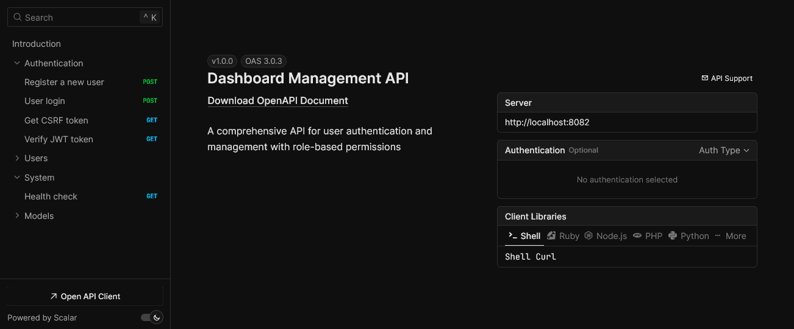

# AI-Powered Admin Dashboard

        

An intelligent and modern admin dashboard built with **React**, **Tailwind CSS**, and a **Node.js/Express backend**.  
Designed as a **boilerplate for SaaS and AI-enabled applications**, it comes with **multi-tenancy support, role-based access control, API documentation, and multilingual configuration** out of the box.


**Where Design Meets Intelligence — The AI-Enhanced Dashboard Boilerplate.**

## ✨ Features

- ⚡ **AI Enabler** – ready to integrate artificial intelligence.  
- 🏢 **SaaS Ready (Multi-Tenancy)** – supports multi-tenant architecture for SaaS applications.  
- 🌍 **Multi Language Support** – built-in multilingual support.  
- 📖 **Interactive API Documentation** – comprehensive and interactive API documentation.  
- 🚀 **Optimized Loading Performance** – faster performance with chunking build optimization.  
- 🔒 **Role-Based Access Control (RBAC)** – fine-grained access control by roles.  
- **MCP (Model Context Protocol) Ready** – fully compatible with MCP protocol for model integration.  
- **CSRF Protection** – enhanced security with CSRF protection.  
- **Chat AI** – supports both streaming and post modes.  
- **Social Media Login** – authentication with popular social media accounts.  
- **Soft Delete** – data is never permanently deleted, only marked as removed.  
- **Rate Limiting** – request throttling to prevent abuse.  

## Extra Advantages

- **Compatible with npm and Bun** – flexible for different development setups.  
- **Frontend Build Compression** – optimized and compressed builds for faster loading.  
- **Custom Fetch Utility** – simplifies development with a custom fetch wrapper.  
- **Configurable Multilingual Support** – available languages can be adjusted in `src\translations\available-language.json`.  
- **Web Server Configurations** – ready-to-use setup for Apache and Nginx deployment.  

## Prerequisites

- Node.js (version 16 or higher)  
- Vite  
- Tailwind CSS  
- Bun or npm  
- PostgreSQL database  

## 📦 Tech Stack

- **Frontend**: React + Tailwind + Vite
- **Backend**: Node.js + Express
- **Database**: PostgreSQL
- **Package Manager**: Bun / npm


## 🚀 Quick Start Setup

1. Install dependencies:  
   ```bash
   bun install
   ```

2. Initialize the database:
   ```bash
   bun run db:init
   ```

3. Run frontend (port 8085)
   ```bash
   bun run dev
   ```

4. Run API server (port 8088)
   ```bash
   bun run api:dev
   ```

5. Run both together
   ```bash
   bun run dev:all
   ```

## Environment Configuration

Create a `.env` file based on the provided template with your configuration:
- Frontend runs on port **8085** by default
- API server runs on port **8088** by default
- Configure your PostgreSQL database connection
- Configure your email settings for email notifications (optional)

## Email Library

This application includes a built-in email library for sending emails. To use it:

1. Configure your email settings in the `.env` file:  
   ```env
   EMAIL_HOST="smtp.your-provider.com"
   EMAIL_PORT=587
   EMAIL_USERNAME="your_email@example.com"
   EMAIL_PASSWORD="your_password"
   ```

2. Import and use the email service in your code:  
   ```typescript
   import { emailService } from './src/lib';

   // Send a simple text email
   await emailService.sendText(
     'recipient@example.com',
     'Subject Line',
     'Email body content'
   );
   ```

For detailed documentation, see [Email Library Documentation](./docs/email-library.md).

## Running the Application

### Development Mode

1. **Frontend only:**  
   ```bash
   bun run dev
   ```
   Runs the Vite development server on port 5173 (http://localhost:5173).

2. **API Server only:**  
   ```bash
   bun run api:dev
   ```
   Runs the Express API server on port 8082 (http://localhost:8082).

3. **Both API and Frontend simultaneously:**  
   ```bash
   bun run dev:all
   ```
   Runs both servers concurrently using the `concurrently` package.

### Production Build

1. **Build the frontend:**  
   ```bash
   bun run build
   ```
   Creates an optimized production build in the `dist` folder.

2. **Preview the production build:**  
   ```bash
   bun run preview
   ```
   Serves the production build locally for testing.

## API Endpoints

Once the API server is running, you can access:  
- Health check: http://localhost:8088/api/health  
- Auth endpoints: http://localhost:8088/api/auth/...  

## Database Management

Make sure dependencies are installed. For Linux users, run this command first:  

```bash
chmod +x cleanup
```

- Initialize database: `bun run db:init`  
- Reset database: `bun run db:reset`  
- Check migration status: `bun run db:status`  
- Deploy migrations: `bun run db:deploy`  
- Create new migration: `bun run db:migration`  

## Development Scripts

- Run TypeScript validation: `bun run validate`  
- Run linting: `bun run lint`  

## Default Users

For testing purposes, the database seeding creates the following default users:

1. **Admin System**  
   email: admin@example.com  
   password: password  

2. **Operator One**  
   email: operator@example.com  
   password: operator  

3. **Regular User**  
   email: user@example.com  
   password: user  

## CSRF Protection

This application implements CSRF (Cross-Site Request Forgery) protection for all authentication forms to prevent malicious attacks.

### How it works:
1. When a user visits the login or signup page, the application automatically fetches a CSRF token from the server.  
2. This token is stored in memory and used for subsequent authentication requests.  
3. All state-changing requests (POST, PUT, DELETE) must include the CSRF token and session ID in their headers.  
4. The server validates these tokens before processing any requests.  

### Testing CSRF Protection:

You can try the following scenarios:  

1. **Valid Request Test**  
2. **Missing CSRF Token Test**  
3. **Invalid CSRF Token Test**  
4. **Valid CSRF Token Test**  

Example curl commands for testing are available in the original documentation.  

## API Documentation

URL: `curl http://localhost:8082/api/docs`  

  

## Deployment

For production deployment, please refer to the following guides:

- [Nginx Deployment Guide](./docs/DEPLOYMENT-nginx.md)  
- [Apache Deployment Guide](./docs/DEPLOYMENT-apache.md)  

---

This dashboard was developed with ❤️ by the [CARIK.id team](https://carik.id).  

_Powered by [Carik](https://carik.id) ⚡_  _Mesin Cerdasnya Indonesia ⚡_
