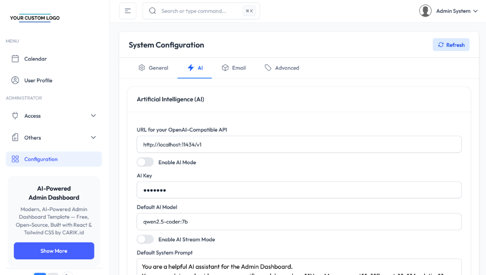

# Configuration Generator

## Overview

The Configuration Generator is an automatic system that creates configuration tabs and components for categories that are not predefined in the main configuration list. This ensures that all configuration categories from the API will be displayed in the browser, even if they're not explicitly coded.




## How It Works

### 1. Predefined Sections
The system starts with three predefined configuration sections:
- **General** - Uses `ConfigurationGeneral` component
- **AI** - Uses `ConfigurationAI` component  
- **Advanced** - Uses `ConfigurationAdvanced` component

### 2. Dynamic Section Generation
When configurations are loaded from the API, the generator:

1. **Extracts all unique sections** from the configuration data
2. **Filters out predefined sections** to avoid duplicates
3. **Generates dynamic components** for remaining sections using the template
4. **Creates tab entries** with appropriate icons and names

### 3. Template-Based Components
Dynamic sections use the `generateDynamicConfigurationComponent()` function which:
- Creates a React component based on the `_template.tsx` pattern
- Handles form state management automatically
- Provides save functionality with proper error handling
- Shows empty state when no configurations exist for a section

## File Structure

```
src/
├── pages/Configuration/
│   └── ConfigurationPage.tsx          # Main configuration page with generator logic
├── components/configuration/
│   ├── _template.tsx                  # Template for dynamic components
│   ├── general.tsx                    # Predefined General component
│   ├── ai.tsx                         # Predefined AI component
│   └── advanced.tsx                   # Predefined Advanced component
└── utils/
    ├── configurationGenerator.tsx     # Generator utility functions
    └── __tests__/
        └── configurationGenerator.test.tsx  # Unit tests

server/
├── database/
│   └── seed.ts                        # Database seeding with JSON-based configurations
└── data/install_only/
    ├── configuration.json             # Default configuration definitions
    ├── system_prompt.md               # AI system prompt content
    └── users.json                     # Additional user definitions
```

## Usage

### Frontend Usage
The generator works automatically when the ConfigurationPage loads. No manual intervention is required.

### Backend Configuration Management
Default configurations are now managed through the `data/install_only/configuration.json` file. The database seeding process automatically reads this file and processes special cases like environment variables and system prompts.

### Example API Response
```json
{
  "success": true,
  "data": {
    "configurations": [
      {
        "section": "general",
        "key": "app_name",
        "value": "My App"
      },
      {
        "section": "email",     // This will be auto-generated
        "key": "smtp_host",
        "value": "smtp.example.com"
      },
      {
        "section": "payment",   // This will be auto-generated
        "key": "stripe_key",
        "value": "sk_test_..."
      }
    ]
  }
}
```

### Result
- **General** tab - Uses predefined component
- **Email** tab - Auto-generated with CubeIcon
- **Payment** tab - Auto-generated with CubeIcon

## Backend Configuration Management

### Adding New Default Configurations
To add new default configurations, simply edit the `data/install_only/configuration.json` file:

```json
[
  {
    "section": "payment",
    "key": "stripe.public_key",
    "value": "",
    "type": "string",
    "description": "Stripe Public Key",
    "public": true,
    "status_id": 0
  },
  {
    "section": "payment",
    "key": "stripe.secret_key",
    "value": "",
    "type": "secret",
    "description": "Stripe Secret Key",
    "status_id": 0
  }
]
```

### Special Configuration Handling
The seeding process automatically handles special cases:

- **Environment Variables**: AI configurations automatically use environment variables when available
- **System Prompt**: The `ai.system_prompt` value is automatically populated from `system_prompt.md`
- **Default Values**: Fallback values are provided for essential configurations

### Configuration Properties
Each configuration object supports these properties:

- `section` (required): Category name for grouping
- `key` (required): Unique configuration key
- `value` (required): Default value
- `type` (optional): Data type (string, boolean, secret, text)
- `description` (required): Human-readable description
- `public` (optional): Whether the config is publicly accessible
- `order` (optional): Display order within the section
- `status_id` (required): Status identifier (0 = active)

## Customization

### Adding New Predefined Sections
To add a new predefined section:

1. Create a component in `src/components/configuration/`
2. Add it to the `predefinedSections` array in `ConfigurationPage.tsx`

```typescript
const predefinedSections = [
  // existing sections...
  { 
    name: 'Email', 
    icon: EnvelopeIcon, 
    component: ConfigurationEmail, 
    configs: configurations.filter(config => config.section === 'email') 
  },
];
```

### Customizing Dynamic Section Icons
Currently all dynamic sections use `CubeIcon`. To customize:

```typescript
const getSectionIcon = (sectionName: string) => {
  const iconMap: Record<string, any> = {
    'email': EnvelopeIcon,
    'payment': CreditCardIcon,
    'security': ShieldCheckIcon,
  };
  return iconMap[sectionName.toLowerCase()] || CubeIcon;
};
```

## Benefits

### Frontend Generator Benefits
1. **Automatic Discovery** - No need to manually add new configuration categories
2. **Consistent UI** - All sections follow the same template pattern
3. **Maintainable** - Single template file for all dynamic sections
4. **Extensible** - Easy to customize icons and behavior per section
5. **Error Handling** - Built-in error states and loading indicators

### Backend Configuration Management Benefits
6. **Centralized Configuration** - All default configurations are now in one JSON file (`data/install_only/configuration.json`)
7. **Easy Maintenance** - No need to modify TypeScript code to add/remove configurations
8. **Environment Variable Support** - Still handles environment variables for AI settings automatically
9. **System Prompt Integration** - Automatically injects the system prompt from the markdown file
10. **Consistent Pattern** - Uses the same `readFile` utility pattern as other data files
11. **Version Control Friendly** - JSON configuration changes are easier to track and review
12. **Non-Developer Friendly** - Configuration changes can be made without TypeScript knowledge

## Testing

Run the generator tests:
```bash
npm test configurationGenerator
# or
npm test configurationGenerator.test.ts
```

The tests verify:
- Dynamic component generation
- Proper section naming
- Empty state handling
- Save functionality
