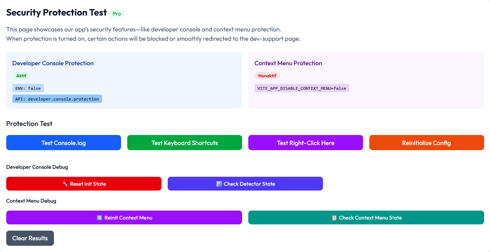
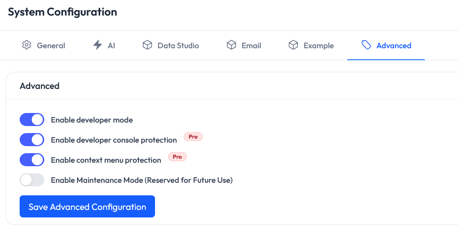

# DEVELOPER CONSOLE PROTECTION - PRO VERSION

## Overview
Fitur Developer Console Protection menyediakan proteksi terhadap akses tidak sah ke **developer tools browser** dan **context menu**.  
Sistem mendukung konfigurasi melalui **Environment Variable** maupun **API Configuration** setelah user login.



## Konfigurasi

### Environment Variables
Tambahkan konfigurasi berikut di file `.env`:

```env
VITE_APP_DISABLE_DEVELOPER_CONSOLE=false
VITE_APP_DISABLE_CONTEXT_MENU=false
```

- `VITE_APP_DISABLE_DEVELOPER_CONSOLE=true`: Mengaktifkan proteksi developer console
- `VITE_APP_DISABLE_DEVELOPER_CONSOLE=false`: Menonaktifkan proteksi developer console
- `VITE_APP_DISABLE_CONTEXT_MENU=true`: Mengaktifkan proteksi context menu
- `VITE_APP_DISABLE_CONTEXT_MENU=false`: Menonaktifkan proteksi context menu




### API Configuration
Setelah login, sistem akan mencoba memuat konfigurasi proteksi melalui API.

Key yang digunakan:
```
developer.console.protection
```

Value: `true` (aktifkan proteksi) atau `false` (nonaktifkan proteksi).

Jika API gagal, maka sistem fallback ke konfigurasi environment variable.

### Priority Logic
```javascript
// Final enabled status
this.isEnabled = disableDeveloperConsole || import.meta.env.VITE_APP_DISABLE_DEVELOPER_CONSOLE === 'true';
```

Proteksi akan aktif jika:
- API configuration = `true`, ATAU
- Environment variable = `true`, ATAU
- Keduanya = `true`

## Fitur Proteksi

### 1. Deteksi Developer Console
- Mendeteksi ketika developer console dibuka menggunakan berbagai metode
- Monitoring ukuran window untuk mendeteksi perubahan
- Deteksi aktivitas console.log dan debugger statement

### 2. Disable Keyboard Shortcuts
- **F12**, **Ctrl+Shift+I**, **Ctrl+Shift+J**, **Ctrl+U**, **Ctrl+Shift+C**

### 3. Disable Context Menu
- Menonaktifkan right-click context menu
- Mencegah akses "Inspect Element" melalui context menu

### 4. Disable Console Methods
- `console.log`, `console.warn`, `console.error`, `console.info`, `console.debug`,
  `console.trace`, `console.table`, `console.group`, `console.groupEnd`, `console.clear`

### 5. Auto Redirect
- Jika developer console terbuka, user akan diarahkan ke halaman `/dev-support`
- `/dev-support` berisi instruksi menutup developer console, tombol kembali ke beranda, dan auto-redirect ke beranda

### 6. Tambahan Proteksi
- Disable text selection (`user-select: none`)
- Disable drag & drop (`ondragstart`, `onselectstart`)

## Implementasi

### Utility Class
```typescript
// src/utils/devConsoleDetector.ts
import DevConsoleDetector from '../utils/devConsoleDetector';

const detector = DevConsoleDetector.getInstance();
detector.startMonitoring();
```

### React Hook
```typescript
// src/hooks/useDevConsoleProtection.ts
import useDevConsoleProtection from '../hooks/useDevConsoleProtection';

const { isProtectionEnabled } = useDevConsoleProtection();
```

### React Component
```typescript
// src/components/security/DevConsoleProtection.tsx
import DevConsoleProtection from '../components/security/DevConsoleProtection';

<DevConsoleProtection>
  <App />
</DevConsoleProtection>
```

### Monitoring Status
```typescript
import DevConsoleStatus from '../components/security/DevConsoleStatus';

<DevConsoleStatus />
```

### Routing
```typescript
// src/App.tsx
<Route path="/dev-support" element={<DevSupport />} />
```

## Files Modified
- `src/utils/devConsoleDetector.ts`
- `src/hooks/useDevConsoleProtection.ts`
- `src/components/security/DevConsoleProtection.tsx`
- `src/components/security/DevConsoleStatus.tsx`
- `src/pages/OtherPage/DevConsoleDemo.tsx`

## Testing
1. Akses halaman demo `/dev-console-check`
2. Login/logout untuk melihat perubahan konfigurasi
3. Klik **Reinitialize Config** untuk manual refresh
4. Test keyboard shortcuts (F12, Ctrl+Shift+I)
5. Test console.log dan context menu

## Best Practices
1. Nonaktifkan proteksi saat **development mode**
2. Aktifkan proteksi saat **production mode**
3. Test di berbagai browser & device
4. Dokumentasikan konfigurasi untuk tim development
5. Aplikasi tetap berfungsi meskipun proteksi gagal

## Troubleshooting
- **Proteksi tidak berfungsi**: pastikan `.env` sudah benar, restart aplikasi, clear cache
- **False positive detection**: atur threshold atau interval di `devConsoleDetector.ts`
- **Performance issues**: tingkatkan interval monitoring atau disable metode deteksi tertentu


**[Buy Browser Security Package](https://carik.id/browser-security)**
